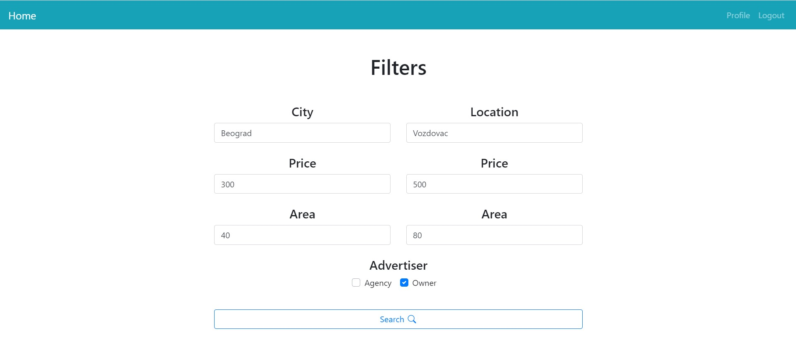
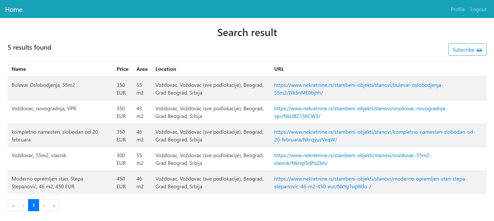
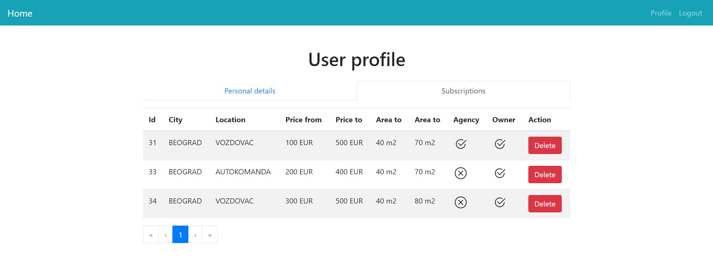

# Apartment Search

The goal of this project is to help in searching apartment ads. After registration and login, user can search for apartments by multiple parameters like city, location, price, area and advertiser.





Also, user can subscribe to a specific search if he wants to be notified by email when new parameter-matched apartment appears.



## Prerequisites

[Node.js](https://nodejs.org/en/), [Npm](https://www.npmjs.com/get-npm) and [Git](https://git-scm.com/).

## Getting Started

These instructions will get you a copy of the project up and running on your local machine:

+ Clone this repo:
``` 
git clone https://github.com/programer20/clojure-project-client.git
```
+ Open a terminal, navigate to project directory and run:
``` 
npm install
npm run serve
```
